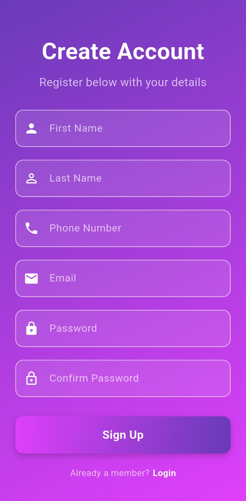
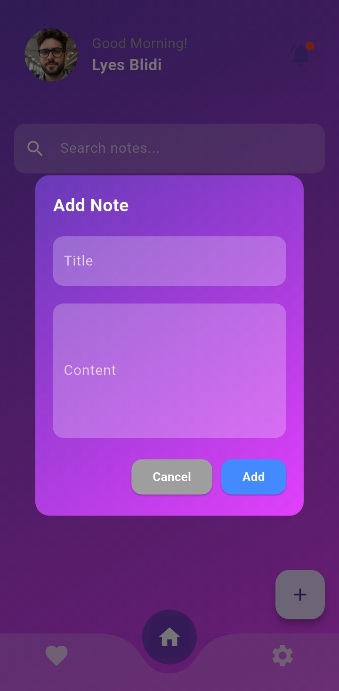
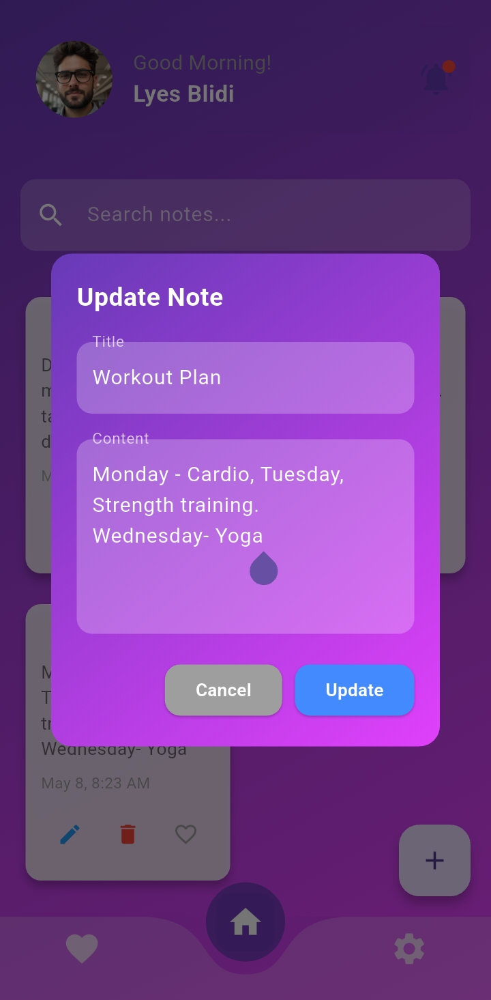
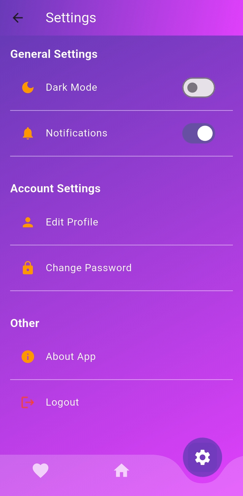

# 📓 Notes App

A simple and elegant note-taking app built with **Flutter**.  
This app allows users to manage their notes efficiently with features like login, registration, favorites, notifications, and more.

---

## ✨ Features

- 🔐 **Authentication**: Login, registration, and forgot password functionality  
- 🏠 **Home Page**: View all notes with options to add, edit, and delete  
- ⭐ **Favorites**: Mark notes for quick access  
- 🔔 **Notifications**: Receive and manage notifications  
- ⚙️ **Settings**: Update preferences, change password  
- 💡 **Responsive UI**: Clean and user-friendly design  

---

## 📸 Screenshots

### 🔑 Authentication

| Login | Register | Forgot Password |
|-------|----------|-----------------|
|  |  |  |

### 📝 Notes Management

| Home | Add Note | Update Note |
|------|----------|-------------|
|  |  |  |

### ⭐ Favorites and 🔔 Notifications and ⚙️ Settings

| Favorites | Notifications | Settings |
|-----------|---------------|----------|
|  |  |  |

---

## 🛠️ Tech Stack

- **Frontend**: Flutter (Dart)  
- **Backend**: Firebase Authentication, Cloud Firestore, Firebase Messaging

---

## 🚀 Installation Instructions

1. **Clone the repository**:
   ```bash
   git clone https://github.com/ilyesblidi/notes-app.git
   cd notes-app
2. **Install dependencies**:
   ```bash
   flutter pub get
4. **Run the app**:
   ```bash
   flutter run
